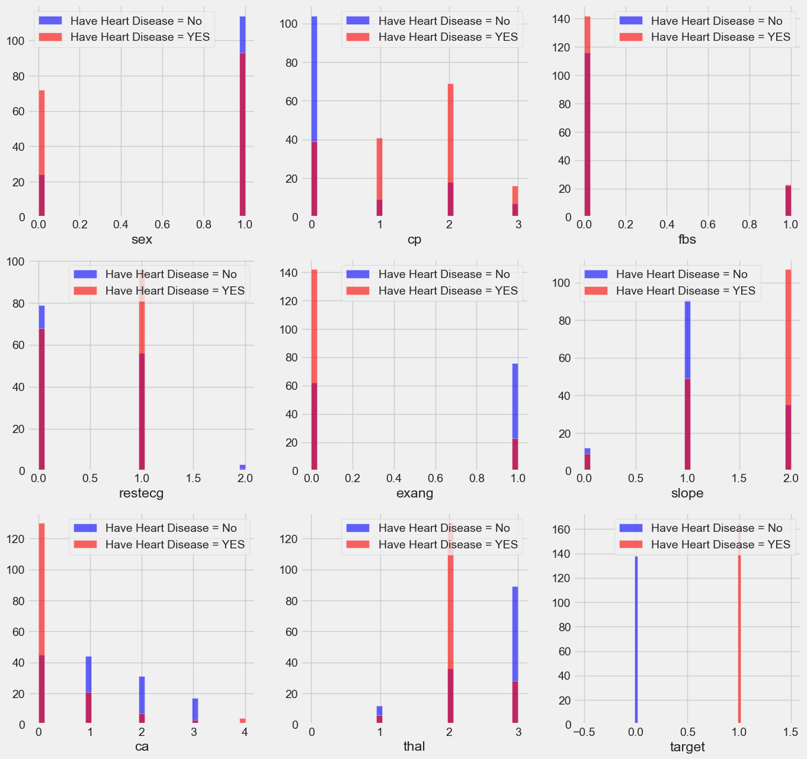
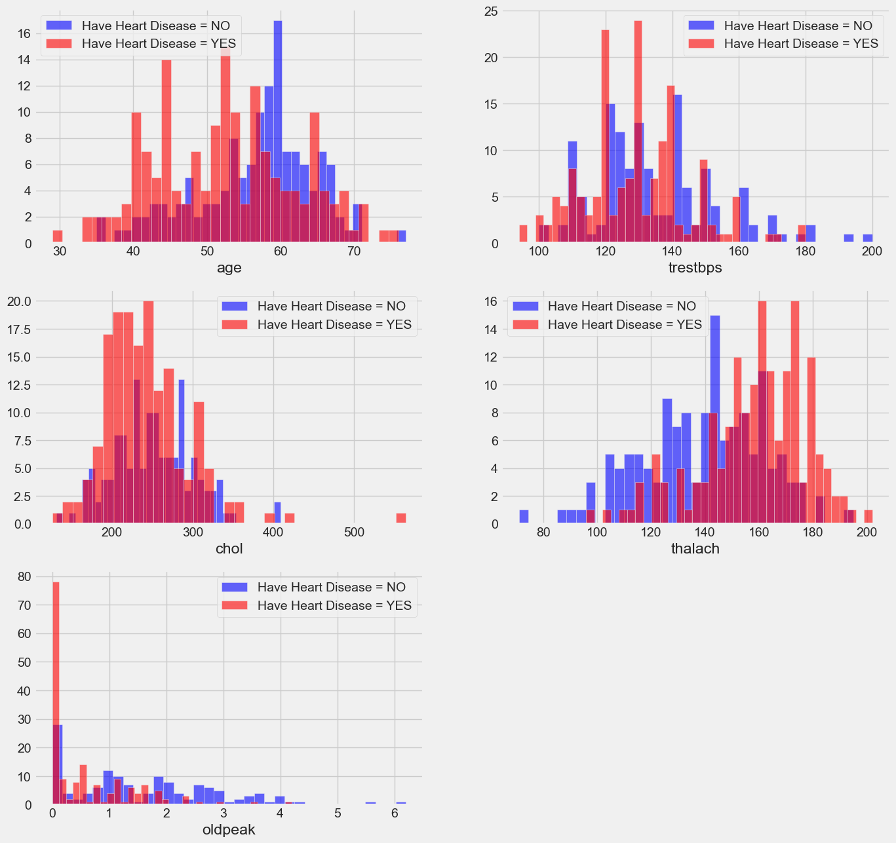
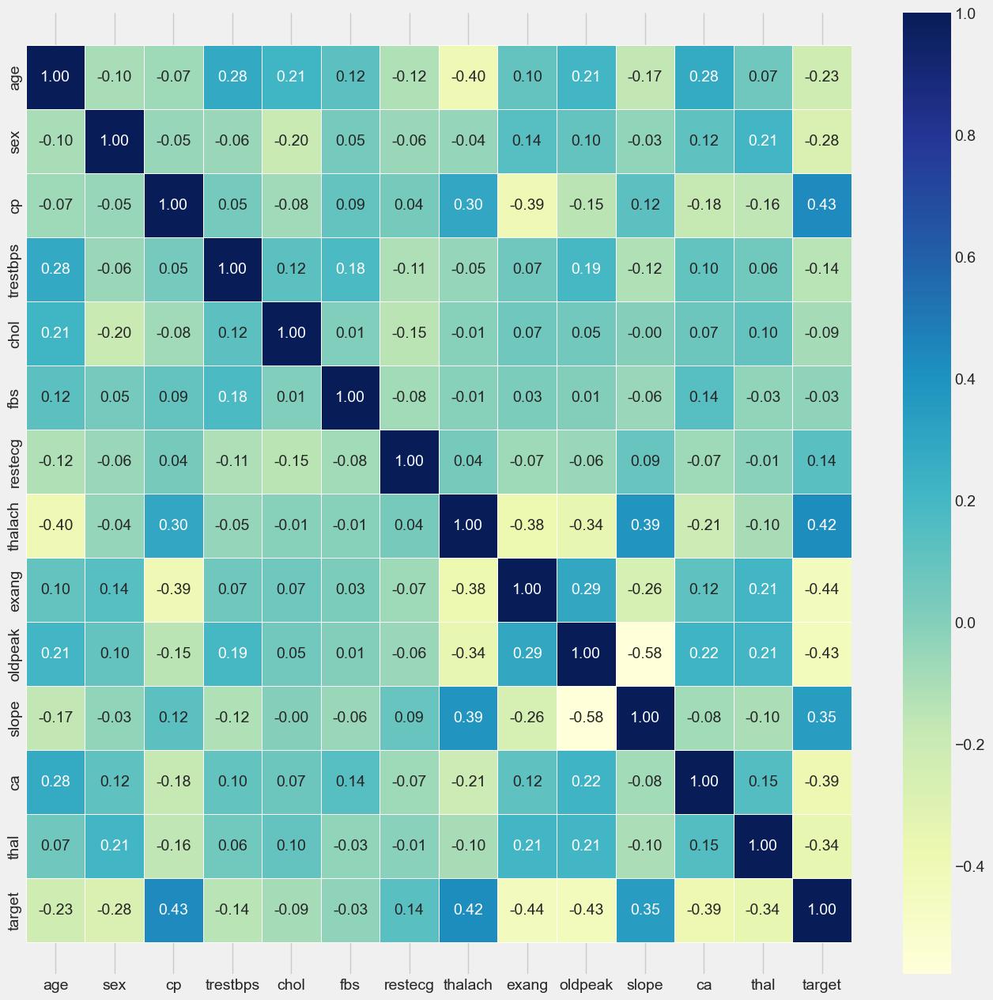

## Description
This GitHub project aims to predict heart disease based on various medical metrics such as age, sex, chest pain type, resting blood pressure, serum cholesterol level, fasting blood sugar, resting electrocardiographic results, maximum heart rate, exercise-induced angina, ST depression, slope of the peak exercise ST segment, number of major vessels colored by fluoroscopy, and thalassemia. The project includes a trained model that achieves an accuracy score of 86.79% on the test data.

## Object
To Predict Heart disease according to following metrics.

## Description
### age: 	Age of the patient in years.
### sex: 	Gender of the patient (typically coded as 0 for female and 1 for male).
### cp: 	Chest pain type (0 to 3):
  - 0: Typical angina
  - 1: Atypical angina
  - 2: Non-anginal pain
  - 3: Asymptomatic
### trestbps:	Resting blood pressure (in mm Hg) measured at the time of the test.
### chol:	Serum cholesterol level (in mg/dl).
### fbs: 	Fasting blood sugar (1 if > 120 mg/dl, 0 otherwise).
### restecg	Resting electrocardiographic results (0 to 2):
- 0: Normal
- 1: Having ST-T wave abnormality
- 2: Showing probable or definite left ventricular hypertrophy
### thalach	Maximum heart rate achieved during exercise (in beats per minute).
### exang	Exercise induced angina (1 if yes, 0 if no).
### oldpeak	ST depression induced by exercise relative to rest (measured in mm).
### slope	Slope of the peak exercise ST segment (0 to 2):
- 0: Upsloping
- 1: Flat
- 2: Downsloping
### ca	Number of major vessels (0-3) colored by fluoroscopy.
### thal	Thalassemia (0 to 3):
- 0: Normal
- 1: Fixed defect
- 2: Reversible defect
### target	Diagnosis of heart disease (1 if presence, 0 if absence).

## Train Result: 
 =======================
Accuracy Score:  86.79%
__________________________
Classification Report: 
               0      1  accuracy  macro avg  weighted avg
precision  0.88   0.86      0.87       0.87          0.87
recall     0.82   0.90      0.87       0.86          0.87
f1-score   0.85   0.88      0.87       0.87          0.87
support   97.00 115.00      0.87     212.00        212.00
__________________________
Confusion Matrix: 
 [[ 80  17]
 [ 11 104]] 
